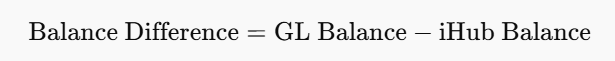

# 🚀 Project Name

## 📌 Table of Contents

- [Introduction](#introduction)
- [Demo](#demo)
- [Inspiration](#inspiration)
- [What It Does](#what-it-does)
- [How We Built It](#how-we-built-it)
- [Challenges We Faced](#challenges-we-faced)
- [How to Run](#how-to-run)
- [Tech Stack](#tech-stack)
- [Testing](#testing-instructions)
- [Team](#team)

---

## 🎯 Introduction

Financial reconciliation is a crucial process that ensures the accuracy of financial records by identifying and resolving discrepancies. Traditional reconciliation methods often involve manual effort, making them time-consuming and prone to errors. To address these challenges, we propose an AI-driven solution that automates reconciliation, enhances anomaly detection, and provides insightful explanations.

Our approach is divided into two key use cases:

1. **Use Case 1: IHub Reconciliation**  
   This use case focuses on detecting **unusual balance differences** using statistical regression models. By analyzing historical transaction patterns, the system identifies deviations that suggest anomalies. If an anomaly is detected, **Llama-3.3-70B** AI generates explanations based on past trends and suggests corrective actions. This approach helps in reducing manual effort and improving the accuracy of financial reconciliation.

2. **Use Case 2: Catalyst Reconciliation**  
   This use case deals with transactional mismatches by combining **rule-based filtering with AI-driven classification**. The system first applies predefined rules to categorize transactions as **valid or ambiguous**. For ambiguous cases, the system leverages **Mistral SABA-24B AI** to analyze discrepancies and classify them as anomalies or acceptable variations. The final results are compiled into structured reports to streamline reconciliation workflows.

By integrating **machine learning models, AI-driven insights, and rule-based logic**, our solution **automates reconciliation, reduces processing time, and enhances decision-making efficiency** in financial operations.

## 🎥 Demo
 
📹 **Video Demo** (if applicable)  
🖼️ **Screenshots**:
**Use Case 1**
- Screenshot 1
- 
- Screenshot 2
-

**Use Case 2**
- Screenshot 1
- 


## 💡 Inspiration

Financial anomalies can lead to **fraud, misreporting, and errors** in financial statements. **Manual reviews are time-consuming and prone to human error.** This project aims to automate and enhance financial auditing processes using AI-powered anomaly detection.

## ⚙️ What It Does

### Use Case 1: IHub Reconciliation

1. **Data Preprocessing:**

   - Load historical and test datasets (CSV/XLSX).
   - Standardize column names for consistency.
   - Compute **balance difference** for each account using:  
     

2. **Anomaly Detection:**

   - Apply multiple **regression models** to detect anomalies:
     - **Linear Model:** Identifies consistent trends.
     - **Sinusoidal Model:** Detects periodic fluctuations.
     - **Quadratic Model:** Captures parabolic patterns.
     - **Logarithmic Model:** Identifies rapid initial changes that slow down over time.
   - Flag significant deviations as anomalies.

3. **AI-Generated Explanations:**

   - If an anomaly is detected, create a **custom prompt** and send it to **Llama-3.3-70B**.
   - AI analyzes historical trends and provides explanations & suggested resolutions.

4. **Final Result Merging:**

   - Combine detected anomalies with test data for clarity.

5. **Report Generation:**
   - Generate an **Excel report** with:  
     ✔ Detected anomalies  
     ✔ AI-generated reasons  
     ✔ Suggested next steps

### Use Case 2: Catalyst Reconciliation

1. **Data Preprocessing:**

   - Load financial transaction data (CSV/XLSX).
   - Convert date fields to datetime format.
   - Standardize numeric values and compute price & quantity differences.

2. **Rule-Based Classification:**

   - If data meets predefined rules (e.g., price/quantity differences within threshold), classify as **“good_to_go”**.
   - If not, mark as **“ambiguous”** for further AI analysis.

3. **AI-Based Classification:**

   - Send ambiguous transactions to **Mistral SABA-24B via GROQ API**.
   - AI analyzes attributes and returns a **structured JSON response** with classification, reason, and root cause.

4. **Final Result Merging:**

   - Combine rule-based and AI classifications into a final dataset.

5. **Report Generation:**
   - Generate a **CSV report** with classified transactions and AI-explained anomalies for analysts.

## 🛠️ How We Built It

- **Streamlit** - Interactive frontend for uploading and viewing results.
- **Python (Pandas, NumPy, SciPy,Pandas, NumPy, RegEx)** - Data processing and statistical modeling.
- **LangChain + Groq API & Mistral SABA-24B via GROQ AP** - AI-powered anomaly reasoning.
- **dotenv** - Secure API key handling.
- **Git & GitHub** - Version control and collaboration.

## 🚧 Challenges We Faced

- **Optimizing anomaly detection models** for financial data.
- **Identiying the right LLM** efficiently in Streamlit.
- **Ensuring API communication** with the LLM for dynamic responses.
- **File uploads and format conversions** within the Streamlit app.

## 🏃 How to Run

### 1️⃣ Clone the repository

```bash
git clone https://github.com/your-repo/anomaly-detection-streamlit.git
cd anomaly-detection-streamlit
```

### 2️⃣ Install dependencies

```bash
pip install -r requirements.txt
```

### 3️⃣ Create a .env file in the root directory

```bash
GROQ_API_KEY=your_api_key_here
```

### 4️⃣ Run the project

```bash
streamlit run app.py
```
### 5️⃣ Accept the model terms at https://console.groq.com/playground?model=mistral-saba-24b


## 🏗️ Tech Stack

🔹 Frontend: Streamlit<br>
🔹 Model: LLama 3.3, Mistral SABA-24B<br>
🔹 Other: LangChain, Groq API, SciPy, Pandas, RegEx

## 👨‍💻 Testing instructions

### Run tests using pytest

```bash
pytest
```

## 👥 Team

- **Disha Agarwal** - [GitHub](https://github.com/DishaAgarwal03/) | [LinkedIn](https://www.linkedin.com/in/dishaagarwal03/)
- **Aniket Saxena** - [GitHub](https://github.com/saxenaAniket) | [LinkedIn](https://www.linkedin.com/in/aniket-saxena-61333221a/)
- **Sara Hasan** - [GitHub](https://github.com/sarahasan17) | [LinkedIn](https://www.linkedin.com/in/sarahasan17/)
